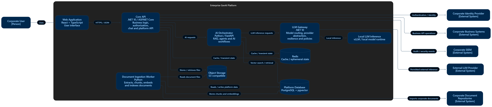

# C4 — Container Diagram

## Enterprise GenAI Platform

Container Diagram показывает основные исполняемые приложения
и хранилища данных внутри Enterprise GenAI Platform.

## Containers

### Web Application

Responsibility:
Предоставляет пользовательский интерфейс платформы:
чат, работу с документами, историю диалогов,
просмотр источников и административные функции.

Technology:
React + TypeScript + Vite.

Why separate:
Frontend имеет отдельную ответственность, lifecycle и deployment.
Он не должен иметь прямого доступа к базам данных,
LLM или внутренним AI-компонентам.

Main dependencies:
- Core API;
- Corporate Identity Provider в рамках authentication flow.

### Core API

Responsibility:
Предоставляет API для frontend, реализует бизнес-логику платформы,
управляет пользователями, чатами, документами,
authorization и координирует работу внутренних сервисов.

Technology:
.NET 10 / ASP.NET Core.

Why separate:
Является основной business/application boundary платформы.
Отделяет пользовательский интерфейс от AI,
хранилищ и корпоративных интеграций.

Main dependencies:
- Platform Database;
- Object Storage;
- Redis;
- AI Orchestrator;
- Corporate Identity Provider;
- Corporate Business Systems;
- Corporate SIEM.

### AI Orchestrator

Responsibility:
Оркестрирует AI workflow.

Например:

retrieval
→ reranking
→ context construction
→ prompt construction
→ agent/tool execution
→ LLM request
→ processing result.

Technology:
Python + FastAPI.

Why separate:
AI-компоненты имеют собственную Python/ML-экосистему,
другой характер нагрузки и могут масштабироваться
независимо от основного backend.

Main dependencies:
- LLM Gateway;
- Platform Database / pgvector;
- Redis;
- разрешённые tools/API.

### Document Ingestion Worker

Responsibility:
Асинхронно обрабатывает документы:

extract
→ clean
→ chunk
→ embeddings
→ indexing.

Technology:
Python.

Why separate:
Обработка документов может занимать много времени
и потреблять значительные CPU/GPU-ресурсы.
Она не должна блокировать HTTP API и должна иметь возможность
масштабироваться независимо.

Main dependencies:
- Object Storage;
- Platform Database / pgvector;
- Corporate Document Repositories;
- механизм асинхронных заданий.

### LLM Gateway

Responsibility:
Предоставляет единый интерфейс обращения к LLM.

Отвечает за:

model routing;
provider abstraction;
timeouts;
retry;
fallback;
rate limiting;
token accounting;
policy enforcement.

Technology:
.NET 10 / ASP.NET Core.

Why separate:
Централизует доступ ко всем LLM и не позволяет
каждому AI-сервису самостоятельно интегрироваться
с разными провайдерами.

Main dependencies:
- Local LLM Inference;
- External LLM Provider.

### Platform Database

Responsibility:
Хранит долговременные данные платформы:

users;
chats;
messages;
document metadata;
chunks;
embeddings;
другие persistent данные.

Technology:
PostgreSQL + pgvector.

Why separate:
Является основным persistent source of truth
и имеет отдельные требования к backup,
recovery, consistency и масштабированию.

Main dependencies:
Не зависит от прикладных контейнеров.
Используется Core API, AI Orchestrator и Ingestion Worker.

### Object Storage

Responsibility:
Хранит бинарные файлы:

original documents;
generated files;
другие крупные объекты.

Technology:
S3-compatible Object Storage.
Для локального проекта — MinIO.

Why separate:
Большие бинарные файлы нецелесообразно смешивать
с основной реляционной базой данных.

Main dependencies:
Используется Core API и Document Ingestion Worker.

### Redis

Responsibility:
Хранит временные данные и cache,
к которым нужен быстрый доступ.

Technology:
Redis.

Why separate:
Позволяет получать временные и часто используемые данные
быстрее основной базы.

Redis не является source of truth
для критичных данных платформы.

Main dependencies:
Используется Core API и AI Orchestrator.

### Local LLM Inference

Responsibility:
Выполняет inference локально размещённых LLM.

Technology:
vLLM.

В дальнейшем:
GPU runtime и локальные модели, например Qwen или GPT-OSS.

Why separate:
Позволяет выполнять AI inference внутри инфраструктуры организации
и снижает необходимость передачи корпоративных данных
внешним LLM-провайдерам.

Main dependencies:
- model weights;
- GPU/compute infrastructure.