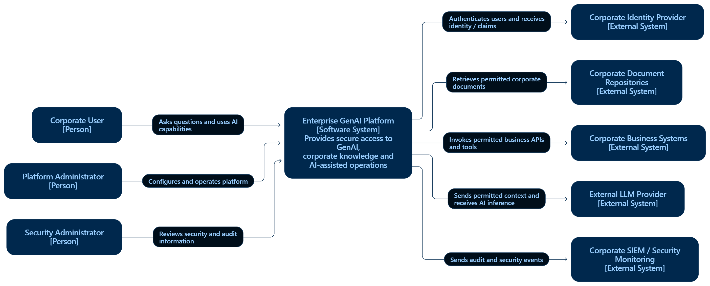

# C4 — System Context

## Enterprise GenAI Platform

### Purpose

Enterprise GenAI Platform предоставляет сотрудникам
единый безопасный интерфейс для использования генеративного AI
при работе с корпоративной информацией и системами.

## People

### Corporate User

Сотрудник организации, использующий Enterprise GenAI Platform
для работы с AI, корпоративными документами и разрешёнными
корпоративными системами.

Права пользователя определяют, к каким корпоративным данным
и операциям он имеет доступ.

### Platform Administrator

Сотрудник организации с повышенными административными правами.

Следит за работоспособностью платформы, управляет её конфигурацией,
AI-моделями, интеграциями и другими настройками платформы.

### Security Administrator

Сотрудник, отвечающий за контроль безопасности платформы.

Анализирует audit-события, подозрительную активность,
попытки несанкционированного доступа и другие события безопасности.

## External Systems

### Corporate Identity Provider

Корпоративная система идентификации и аутентификации пользователей.

Enterprise GenAI Platform использует OpenID Connect / OAuth 2.0
для аутентификации пользователя и получения информации,
необходимой для проверки его прав доступа.

В качестве реализации может использоваться, например, Keycloak или Microsoft Entra ID.

### Corporate Document Repositories

Внутренние системы хранения документов и корпоративных знаний.

Enterprise GenAI Platform получает из них документы,
метаданные и информацию, необходимую для построения
корпоративной базы знаний.

Примеры:

- Confluence;
- SharePoint;
- DMS;
- файловые хранилища.

### Corporate Business Systems

Внутренние информационные системы организации,
содержащие бизнес-данные или предоставляющие бизнес-операции.

Enterprise GenAI Platform может обращаться к разрешённым API
этих систем через AI-агентов и другие интеграции.

Примеры:

- Jira;
- CRM;
- ERP;
- HR-система;
- Project Management System;
- внутренние REST API.

### External LLM Provider

Внешний поставщик LLM, который может использоваться платформой
для выполнения AI inference.

Примером является OpenAI.

Передача корпоративных данных во внешние LLM должна контролироваться
политиками безопасности организации.

Приоритет по возможности должен отдаваться локальным моделям
для сценариев, содержащих конфиденциальные корпоративные данные.

### Corporate SIEM / Security Monitoring

Корпоративная система централизованного мониторинга
и анализа событий безопасности.

Enterprise GenAI Platform передаёт в неё необходимые
security-события и audit-информацию для обнаружения
подозрительной активности и расследования инцидентов.

В качестве реализации может использоваться Splunk.

## System Boundary Decision

Enterprise GenAI Platform включает компоненты,
которые разрабатываются и эксплуатируются как часть нашей платформы.

К внутренним компонентам относятся:

- Web Application;
- .NET backend;
- Python AI services;
- RAG;
- AI Agent Orchestration;
- LLM Gateway;
- PostgreSQL;
- pgvector;
- Redis;
- Object Storage;
- Local LLM и связанная с ней inference-инфраструктура.

Эти компоненты находятся внутри границы Enterprise GenAI Platform
и поэтому не показываются отдельно на C4 System Context Diagram.

Внешними считаются системы, жизненный цикл которых
не контролируется нашей платформой и с которыми она интегрируется.

К ним относятся:

- Corporate Identity Provider;
- Corporate Document Repositories;
- Corporate Business Systems;
- External LLM Provider;
- Corporate SIEM / Security Monitoring.