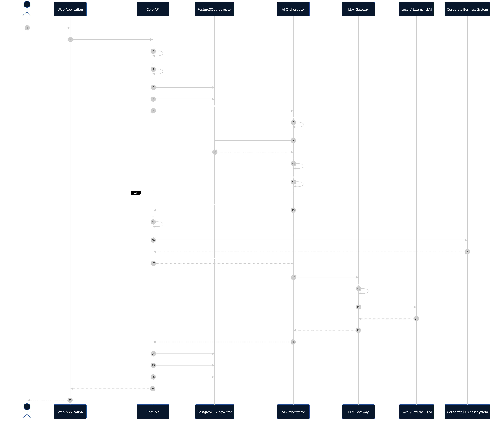
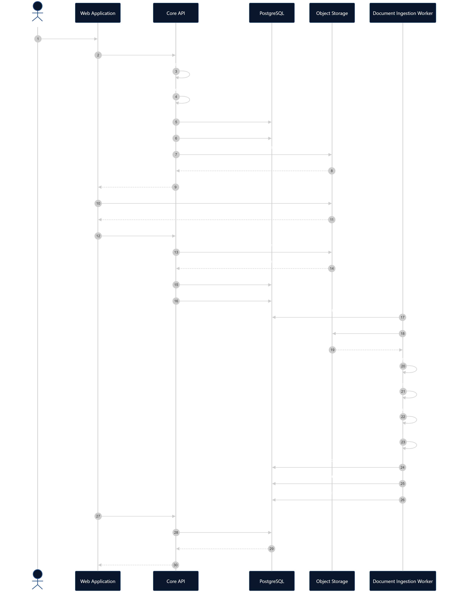

# Потоки данных, диаграммы последовательности и границы безопасности

## 1. Границы безопасности

| Граница                               | Почему это граница                                                                                           |
| ------------------------------------- | ------------------------------------------------------------------------------------------------------------ |
| Browser -> Core API                   | Клиент полностью недоверенный. Проверки на frontend не являются механизмом безопасности.                     |
| Corporate IdP -> Platform             | Мы принимаем данные об идентичности пользователя только из токенов, выпущенных доверенным Identity Provider. |
| Core API -> AI Orchestrator           | AI-слой не должен становиться источником окончательного решения для прав доступа.                            |
| AI Orchestrator -> Data               | Поиск данных не должен обходить ACL.                                                                         |
| Platform -> External LLM              | Корпоративные данные могут покидать инфраструктуру организации.                                              |
| LLM -> Tool Execution                 | Ответ модели является вероятностным и считается недоверенным вводом.                                         |
| Browser -> Object Storage             | Пользователь получает ограниченный и временный доступ к конкретному файлу.                                   |
| Document -> LLM Prompt                | Документ может содержать вредоносные инструкции для модели.                                                  |
| Platform -> Corporate Business System | AI может инициировать реальные бизнес-операции и изменение данных.                                           |
| Platform -> SIEM                      | Передаются события безопасности и аудита.                                                                    |

---

## 2. Поток обработки вопроса AI

```text
Corporate User
       │
       V
React
       │
       │ Question + Access Token
       V
Core API
       │
       ├── Authentication
       ├── Authorization
       ├── Rate Limit
       ├── Save User Message
       └── Create AI Request [PENDING]
       │
       V
AI Orchestrator
       │
       ├── Query Embedding
       ├── Retrieval
       ├── Security Filtering
       ├── Reranking
       └── Context Construction
       │
       V
LLM Gateway
       │
       ├── Policy Check
       ├── Model Routing
       └── Fallback
       │
       V
Local / External LLM
       │
       V
AI Orchestrator
       │
       V
Core API
       │
       ├── Save Response
       ├── Save Metadata
       ├── Mark AI Request [COMPLETED]
       └── Audit (Аудит)
       │
       V
React
```

AI Request считается принятым системой после успешного сохранения в базе данных:

- сообщения пользователя;
- AI Request со статусом `PENDING`.

Желательно сохранять их в одной транзакции.

---

## 3. Диаграмма последовательности обработки вопроса AI



---

## 4. Поток загрузки документа

```text
Browser
   │
   │ Request Upload
   V
Core API
   │
   ├── Authorize
   ├── Validate Metadata
   ├── Create Document
   └── Save ACL / Classification
   │
   V
Object Storage
   │
   └── Temporary Upload URL
   │
   V
Browser

Browser
   │
   │ PUT File
   V
Object Storage
```

После загрузки файла:

```text
Browser
   │
   V
Core API
   │
   ├── Verify Object / Size / Checksum
   ├── Mark Document [UPLOADED]
   └── Create Ingestion Job
   │
   V
Document Ingestion Worker
   │
   ├── Extract Text
   ├── Clean
   ├── Chunk
   ├── Generate Embeddings
   └── Index
   │
   V
PostgreSQL + pgvector
   │
   └── Document [READY]
```

---

## 5. Диаграмма последовательности загрузки документа



---

## 6. Поведение системы при сбоях

| Ситуация                                       | Ожидаемое поведение                                                                                    |
| ---------------------------------------------- | ------------------------------------------------------------------------------------------------------ |
| Core API упал до сохранения сообщения          | Запрос считается непринятым.                                                                           |
| Сообщение сохранено, AI упал                   | Сообщение остаётся. Для временных ошибок выполняется ограниченный retry, затем AI Request -> `FAILED`. |
| Основная LLM упала                             | LLM Gateway пробует только разрешённую резервную модель.                                               |
| Fallback запрещён Security Policy              | Возвращается контролируемая ошибка. Ограничения безопасности не ослабляются.                           |
| PostgreSQL недоступен                          | Новый AI-вызов не запускается.                                                                         |
| Worker упал во время обработки                 | Задача должна быть повторена с ограниченным количеством retry.                                         |
| Документ не удалось распарсить                 | Document -> `FAILED`, оригинальный файл сохраняется.                                                   |
| SIEM недоступен                                | Событие аудита не должен потеряться; доставка повторяется позже.                                       |
| Business System недоступна                     | Tool Execution возвращает контролируемую ошибку.                                                       |
| Пользователь повторил изменяющий данные запрос | Используется Idempotency Key / Operation ID, чтобы операция не выполнилась повторно.                   |

---

## 7. Принципы безопасности

### 7.1 Zero доверие между границами

Данные, поступающие через внешнюю или trust boundary, не считаются доверенными автоматически.

Browser, документы, LLM responses и внешние API должны рассматриваться как потенциально недоверенные источники.

### 7.2 Запрещать по умолчанию

Если система не может однозначно определить, что операция разрешена, операция должна быть запрещена.

Отсутствие правила `ALLOW` означает `DENY`.

### 7.3 Принцип минимальных привилегий

Пользователи, сервисы и AI агенты должны получать только минимально необходимые права для выполнения операции.

### 7.4 Авторизация до раскрытия данных

Проверка доступа должна происходить до передачи защищённых корпоративных данных в AI-компоненты или LLM.

### 7.5 Авторизация непосредственно перед выполнением действия

Любая операция, изменяющая состояние корпоративной системы, должна повторно проверяться доверенным backend непосредственно перед выполнением.

### 7.6 Многоуровневая защита

Безопасность не должна зависеть от одного механизма.

Authorization должна обеспечиваться несколькими уровнями:

- Core API;
- фильтрация результатов поиска по правам;
- ограничения на уровне базы данных, где это оправданно;
- LLM Routing Policy.

### 7.7 LLM не является источником решений безопасности

LLM не должна принимать окончательные решения о правах доступа, разрешениях или выполнении операций.

LLM Output рассматривается как недоверенный ввод.

### 7.8 Найденный контент считается недоверенным

Содержимое корпоративных документов считается данными, а не системными инструкциями.

Документы могут содержать внедрение инструкций в промпт и не должны иметь возможности изменять Security Policy платформы.

### 7.9 Минимизация данных

Во внешнюю LLM должны передаваться только данные, необходимые для выполнения конкретного запроса.

Лишние корпоративные данные не должны попадать в Prompt.

### 7.10 Маршрутизация LLM с учётом безопасности

Выбор Local LLM или External LLM должен учитывать классификацию обрабатываемых данных.

Резервное переключение не должен обходить ограничения безопасности.

### 7.11 Аудируемость

Критические операции и обращения к защищённым данным должны оставлять устойчивый аудиторский след.

### 7.12 Безопасный отказ

При отказе security-компонента система не должна автоматически ослаблять ограничения безопасности.

Если невозможно подтвердить разрешение, операция должна быть отклонена.

---

## 8. Открытые архитектурные вопросы

| Вопрос                                                                    | Решение                                                                                                                                                                                                                                                    |
| ------------------------------------------------------------------------- | ---------------------------------------------------------------------------------------------------------------------------------------------------------------------------------------------------------------------------------------------------------- |
| Когда AI-запрос считается принятым системой?                              | После успешного сохранения `User Message` и `AI Request [PENDING]` в БД. Желательно в одной транзакции.                                                                                                                                                    |
| Что делать, если AI не ответил?                                           | Сообщение пользователя остаётся. Для transient errors выполняется ограниченный retry. После исчерпания попыток AI Request получает статус `FAILED`. Пользователь может повторить запрос.                                                                   |
| Где применяется Authorization при Vector Search?                          | Core API принимает основное решение; Retrieval Layer всегда применяет обязательный ACL filter; PostgreSQL/RLS может использоваться как Defense in Depth. Frontend отвечает только за UX. LLM Gateway проверяет outbound/model policy, а не ACL документов. |
| Может ли Local -> External Fallback выполняться для Confidential Request? | Только если Security Policy разрешает передавать данный класс данных конкретному внешнему провайдеру. Если запрещено то возвращается контролируемая ошибка.                                                                                                |
| Кто разрешает Tool Execution?                                             | Core API. LLM только предлагает Tool Call, а Core API проверяет права и разрешает или запрещает операцию.                                                                                                                                                  |
| Что делать, если SIEM недоступен?                                         | Audit Event надёжно сохраняется в БД / Outbox и доставляется в SIEM позже асинхронно.                                                                                                                                                                      |
| Что делать при Duplicate Mutating Tool Request?                           | Использовать Idempotency Key / Operation ID. Повтор операции с тем же идентификатором не должен повторно изменять состояние.                                                                                                                               |
