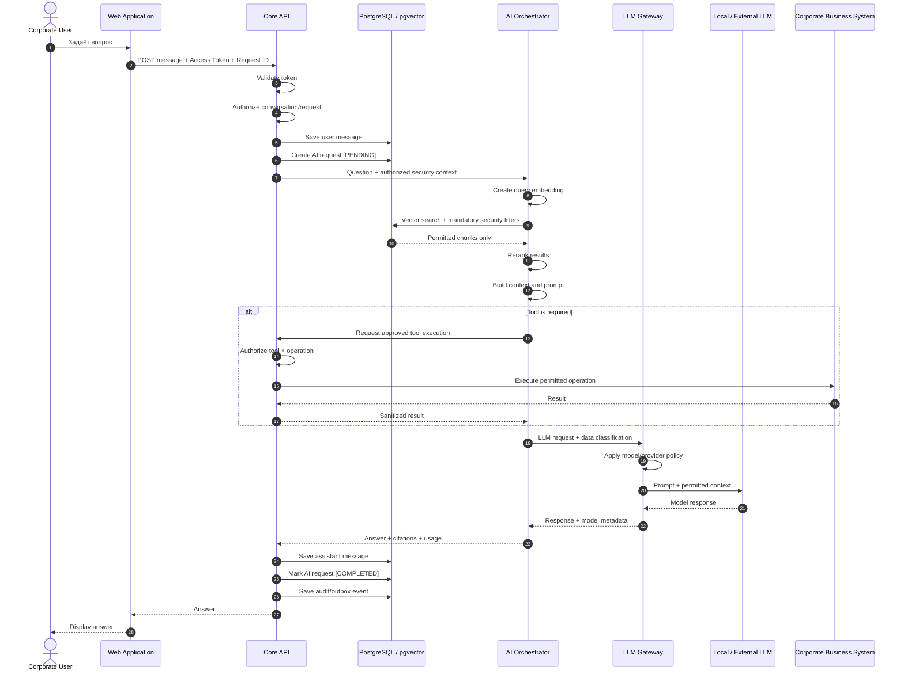
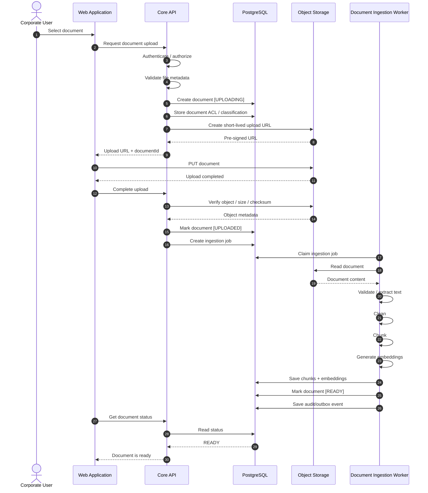

# Data Flows and Security Boundaries (Потоки данных, диаграммы последовательности и границы безопасности)

## 1. Security Boundaries (Границы безопасности)

| Boundary (Граница)                                                              | Почему это граница                                                                                          |
| ------------------------------------------------------------------------------- | ----------------------------------------------------------------------------------------------------------- |
| Browser → Core API (Браузер → Основной API)                                     | Клиент полностью недоверенный. Проверки на frontend (клиентской части) не являются механизмом безопасности. |
| Corporate IdP → Platform (Корпоративный провайдер идентификации → Платформа)    | Мы доверяем identity (данным об идентичности пользователя) только от разрешённого issuer (издателя токена). |
| Core API → AI Orchestrator (Основной API → ИИ-оркестратор)                      | AI-слой не должен становиться authority (источником окончательного решения) для прав доступа.               |
| AI Orchestrator → Data (ИИ-оркестратор → Данные)                                | Retrieval (поиск данных) не должен обходить ACL (списки контроля доступа).                                  |
| Platform → External LLM (Платформа → Внешняя LLM)                               | Корпоративные данные могут покидать инфраструктуру организации.                                             |
| LLM → Tool Execution (LLM → Выполнение инструмента)                             | Ответ модели является вероятностным и считается недоверенным вводом.                                        |
| Browser → Object Storage (Браузер → Объектное хранилище)                        | Пользователь получает ограниченный и временный доступ к конкретному файлу.                                  |
| Document → LLM Prompt (Документ → Промпт LLM)                                   | Документ может содержать prompt injection (вредоносные инструкции для модели).                              |
| Platform → Corporate Business System (Платформа → Корпоративная бизнес-система) | AI может инициировать реальные бизнес-операции и изменение данных.                                          |
| Platform → SIEM (Платформа → SIEM)                                              | Передаются security/audit events (события безопасности и аудита).                                           |

---

## 2. AI Question Flow (Поток обработки вопроса ИИ)

```text
Corporate User (Корпоративный пользователь)
       │
       ▼
React
       │
       │ Question + Access Token
       │ (Вопрос + токен доступа)
       ▼
Core API (Основной API)
       │
       ├── Authentication (Аутентификация)
       ├── Authorization (Авторизация)
       ├── Rate Limit (Ограничение частоты запросов)
       ├── Save User Message (Сохранение сообщения пользователя)
       └── Create AI Request [PENDING]
           (Создание ИИ-запроса [ОЖИДАЕТ ОБРАБОТКИ])
       │
       ▼
AI Orchestrator (ИИ-оркестратор)
       │
       ├── Query Embedding (Создание embedding запроса)
       ├── Retrieval (Поиск релевантных данных)
       ├── Security Filtering (Фильтрация по правам доступа)
       ├── Reranking (Повторное ранжирование)
       └── Context Construction (Формирование контекста)
       │
       ▼
LLM Gateway (Шлюз LLM)
       │
       ├── Policy Check (Проверка политик)
       ├── Model Routing (Выбор модели и маршрута)
       └── Fallback (Переключение на резервную модель)
       │
       ▼
Local / External LLM (Локальная / внешняя LLM)
       │
       ▼
AI Orchestrator (ИИ-оркестратор)
       │
       ▼
Core API (Основной API)
       │
       ├── Save Response (Сохранение ответа)
       ├── Save Metadata (Сохранение метаданных)
       ├── Mark AI Request [COMPLETED]
       │   (Отметить ИИ-запрос как [ЗАВЕРШЁН])
       └── Audit (Аудит)
       │
       ▼
React
```

AI Request (ИИ-запрос) считается принятым системой после успешного сохранения в базе данных:

- User Message (сообщения пользователя);
- AI Request со статусом `PENDING`.

Желательно сохранять их в одной транзакции.

---

## 3. AI Question Sequence Diagram (Диаграмма последовательности обработки вопроса ИИ)




---

## 4. Document Upload Flow (Поток загрузки документа)

```text
Browser (Браузер)
   │
   │ Request Upload
   │ (Запросить загрузку)
   ▼
Core API (Основной API)
   │
   ├── Authorize (Проверить права доступа)
   ├── Validate Metadata (Проверить метаданные)
   ├── Create Document (Создать запись документа)
   └── Save ACL / Classification
       (Сохранить права доступа / классификацию)
   │
   ▼
Object Storage (Объектное хранилище)
   │
   └── Temporary Upload URL
       (Временный URL для загрузки)
   │
   ▼
Browser (Браузер)

Browser
   │
   │ PUT File (Загрузка файла)
   ▼
Object Storage (Объектное хранилище)
```

После загрузки файла:

```text
Browser
   │
   ▼
Core API
   │
   ├── Verify Object / Size / Checksum
   │   (Проверить объект / размер / контрольную сумму)
   ├── Mark Document [UPLOADED]
   │   (Отметить документ как [ЗАГРУЖЕН])
   └── Create Ingestion Job
       (Создать задачу фоновой обработки)
   │
   ▼
Document Ingestion Worker
(Фоновый обработчик документов)
   │
   ├── Extract Text (Извлечь текст)
   ├── Clean (Очистить)
   ├── Chunk (Разбить на фрагменты)
   ├── Generate Embeddings (Создать embeddings)
   └── Index (Проиндексировать)
   │
   ▼
PostgreSQL + pgvector
   │
   └── Document [READY]
       (Документ [ГОТОВ])
```

---

## 5. Document Upload Sequence Diagram (Диаграмма последовательности загрузки документа)




---

## 6. Failure Semantics (Поведение системы при сбоях)

| Ситуация                                                   | Ожидаемое поведение                                                                                                                         |
| ---------------------------------------------------------- | ------------------------------------------------------------------------------------------------------------------------------------------- |
| Core API упал до сохранения сообщения                      | Запрос считается непринятым.                                                                                                                |
| Сообщение сохранено, AI упал                               | Message (сообщение) остаётся. Для transient errors (временных ошибок) выполняется ограниченный retry (повтор), затем AI Request → `FAILED`. |
| Основная LLM упала                                         | LLM Gateway пробует только разрешённую fallback-модель (резервную модель).                                                                  |
| Fallback запрещён Security Policy (политикой безопасности) | Возвращается контролируемая ошибка. Ограничения безопасности не ослабляются.                                                                |
| PostgreSQL недоступен                                      | Новый AI-вызов не запускается.                                                                                                              |
| Worker упал во время обработки                             | Job (задача) должна быть повторена с ограниченным количеством retry.                                                                        |
| Документ не удалось распарсить                             | Document → `FAILED`, оригинальный файл сохраняется.                                                                                         |
| SIEM недоступен                                            | Audit Event (событие аудита) не должен потеряться; доставка повторяется позже.                                                              |
| Business System недоступна                                 | Tool Execution (выполнение инструмента) возвращает контролируемую ошибку.                                                                   |
| Пользователь повторил изменяющий данные запрос             | Используется Idempotency Key / Operation ID, чтобы операция не выполнилась повторно.                                                        |

---

## 7. Security Principles (Принципы безопасности)

### 7.1 Zero Trust Between Boundaries (Нулевое доверие между границами)

Данные, поступающие через внешнюю или trust boundary (границу доверия), не считаются доверенными автоматически.

Browser (браузер), документы, LLM responses (ответы LLM) и внешние API должны рассматриваться как потенциально недоверенные источники.

### 7.2 Deny by Default (Запрещать по умолчанию)

Если система не может однозначно определить, что операция разрешена, операция должна быть запрещена.

Отсутствие правила `ALLOW` означает `DENY`.

### 7.3 Least Privilege (Принцип минимальных привилегий)

Пользователи, сервисы и AI Agents (ИИ-агенты) должны получать только минимально необходимые права для выполнения операции.

### 7.4 Authorization Before Data Exposure (Авторизация до раскрытия данных)

Проверка доступа должна происходить до передачи защищённых корпоративных данных в AI-компоненты или LLM.

### 7.5 Authorization at the Point of Action (Авторизация непосредственно перед выполнением действия)

Любая операция, изменяющая состояние корпоративной системы, должна повторно проверяться доверенным backend непосредственно перед выполнением.

### 7.6 Defense in Depth (Многоуровневая защита)

Безопасность не должна зависеть от одного механизма.

Authorization должна обеспечиваться несколькими уровнями:

- Core API;
- Retrieval Security Filtering (фильтрация результатов поиска по правам);
- Database-Level Restrictions (ограничения на уровне базы данных), где это оправданно;
- LLM Routing Policy (политика маршрутизации LLM).

### 7.7 LLM Is Not a Security Authority (LLM не является источником решений безопасности)

LLM не должна принимать окончательные решения о правах доступа, разрешениях или выполнении операций.

LLM Output (вывод модели) рассматривается как недоверенный ввод.

### 7.8 Retrieved Content Is Untrusted (Найденный контент считается недоверенным)

Содержимое корпоративных документов считается данными, а не системными инструкциями.

Документы могут содержать Prompt Injection (внедрение инструкций в промпт) и не должны иметь возможности изменять Security Policy (политику безопасности) платформы.

### 7.9 Data Minimization (Минимизация данных)

Во внешнюю LLM должны передаваться только данные, необходимые для выполнения конкретного запроса.

Лишние корпоративные данные не должны попадать в Prompt (промпт).

### 7.10 Security-Aware LLM Routing (Маршрутизация LLM с учётом безопасности)

Выбор Local LLM или External LLM должен учитывать классификацию обрабатываемых данных.

Fallback (резервное переключение) не должен обходить ограничения безопасности.

### 7.11 Auditability (Аудируемость)

Критические операции и обращения к защищённым данным должны оставлять устойчивый Audit Trail (аудиторский след).

### 7.12 Fail Secure (Безопасный отказ)

При отказе security-компонента система не должна автоматически ослаблять ограничения безопасности.

Если невозможно подтвердить разрешение, операция должна быть отклонена.

---

## 8. Open Architectural Questions (Открытые архитектурные вопросы)

| Вопрос                                                                   | Решение                                                                                                                                                                                                                                                    |
| ------------------------------------------------------------------------ | ---------------------------------------------------------------------------------------------------------------------------------------------------------------------------------------------------------------------------------------------------------- |
| Когда AI-запрос считается принятым системой?                             | После успешного сохранения `User Message` и `AI Request [PENDING]` в БД. Желательно в одной транзакции.                                                                                                                                                    |
| Что делать, если AI не ответил?                                          | Сообщение пользователя остаётся. Для transient errors выполняется ограниченный retry. После исчерпания попыток AI Request получает статус `FAILED`. Пользователь может повторить запрос.                                                                   |
| Где применяется Authorization при Vector Search?                         | Core API принимает основное решение; Retrieval Layer всегда применяет обязательный ACL filter; PostgreSQL/RLS может использоваться как Defense in Depth. Frontend отвечает только за UX. LLM Gateway проверяет outbound/model policy, а не ACL документов. |
| Может ли Local → External Fallback выполняться для Confidential Request? | Только если Security Policy разрешает передавать данный класс данных конкретному внешнему провайдеру. Если запрещено — возвращается контролируемая ошибка.                                                                                                 |
| Кто разрешает Tool Execution?                                            | Core API. LLM только предлагает Tool Call, а Core API проверяет права и разрешает или запрещает операцию.                                                                                                                                                  |
| Что делать, если SIEM недоступен?                                        | Audit Event надёжно сохраняется в БД / Outbox и доставляется в SIEM позже асинхронно.                                                                                                                                                                      |
| Что делать при Duplicate Mutating Tool Request?                          | Использовать Idempotency Key / Operation ID. Повтор операции с тем же идентификатором не должен повторно изменять состояние.                                                                                                                               |
